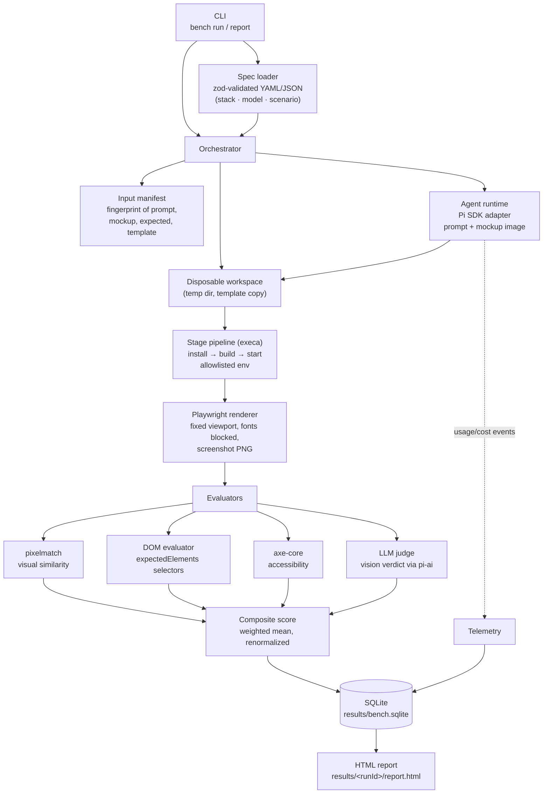

# Web Stack Benchmark Platform

An automated evaluation platform that benchmarks AI coding agents on their ability to build complete front-end web applications from a standardized set of assets — a prompt, a mockup image, and a project skeleton. Given the same inputs, it produces an **objective, reproducible score** for a `(stack × model × scenario)` run, end to end and without human judgment.

## Overview

Comparing LLMs, prompts, and web stacks by eyeballing generated apps is subjective and unrepeatable. This platform replaces that with a fixed pipeline:

1. A **scenario** supplies the task: a natural-language prompt, a pixel-perfect mockup image, and a ground-truth `expected.png`.
2. A **stack** supplies the playing field: a ready-made project template (e.g. Angular + TailwindCSS) with declared install/build/start commands.
3. A **model** supplies the agent brain, driven through the [Pi SDK](https://github.com/earendil-works/pi).

The agent builds the app in a disposable temp workspace; the platform builds and serves the result, screenshots it with headless Playwright, and scores it with four evaluators. Everything — scores, cost, tokens, timings, artifacts — lands in a SQLite database and an HTML report.

## Getting started

Prerequisites: **Node.js ≥ 24** and npm.

```bash
npm install
npx playwright install chromium   # one-time browser binary

npm test            # 194 unit/integration tests
npm run typecheck
```

Run a benchmark (names, not paths — they resolve to `stacks/<name>.yaml`, `models/<name>.json`, `scenarios/<name>/<name>.yaml`):

```bash
npm run bench -- run --stack angular --model deepseek4pro --scenario dashboard
```

Re-render a report for a stored run:

```bash
npm run bench -- report --latest
npm run bench -- report <runId>
```

Regenerate scenario reference screenshots (after editing a `reference.html` or the shared theme):

```bash
npm run capture                 # all scenarios
npm run capture -- dashboard    # one scenario
```

Results land in `results/bench.sqlite` plus `results/<runId>/` (screenshots, diff image, `report.html`).

## Principles

- **Reproducible by construction.** Declarative YAML/JSON specs validated with zod before anything runs; an input fingerprint (prompt + mockup + expected + template) is recorded per run so identical inputs are provably identical.
- **Deterministic rendering.** Fixed viewport, `deviceScaleFactor: 1`, reduced motion, external fonts blocked — the same page yields the same pixels. Reference screenshots are byte-identical across captures.
- **Isolation.** Every run happens in a disposable temp workspace; the repo is never mutated. Spawned install/build/start stages get a default-deny env allowlist (5 keys), so host secrets can't leak into agent-built code.
- **No human in the scoring loop.** Four automated evaluators (pixel diff, DOM structure, accessibility, LLM judge) combine into a weighted composite. Dropped evaluators renormalize rather than scoring zero.
- **Queryable results.** Structured SQLite (WAL) instead of JSON blobs: cost, tokens, per-evaluator scores, and stage timings can be queried without reprocessing.
- **One agent seam.** The Pi SDK is the only path to the agent and is fully encapsulated behind the agent-adapter module; the rest of the platform depends on ports, not the SDK.

## Architecture



## Project structure

```
├── models/                  # Model specs (provider, modelId, params)
├── scenarios/               # Benchmark tasks (see below)
│   ├── _shared/             # Tailwind theme shared by all reference pages
│   └── <name>/              # One directory per scenario
├── stacks/                  # Stack specs + project templates
│   ├── angular.yaml
│   └── angular/template/    # Ready-to-build Angular 22 + Tailwind v4 skeleton
├── scripts/
│   └── capture-reference.ts # Renders reference.html → expected.png/mockup.png
├── src/
│   ├── cli/                 # bench run / report entry point
│   ├── specs/               # zod schemas + loaders for all spec files
│   ├── orchestrator/        # End-to-end run coordination
│   ├── agent/               # Pi SDK adapter (the only Pi import)
│   ├── workspace/           # Disposable temp-workspace lifecycle
│   ├── runtime/             # Staged install/build/start with env allowlist
│   ├── render/              # Playwright renderer + determinism controls
│   ├── eval/                # pixelmatch, DOM, axe, LLM-judge evaluators
│   ├── pipeline/            # Evaluation pipeline + composite scoring
│   ├── manifest/            # Input fingerprinting
│   ├── storage/             # SQLite schema + persistence
│   ├── reports/             # HTML report rendering
│   └── telemetry/           # Usage/cost event mapping
└── tests/                   # vitest suite (fixtures + fakes included)
```

## Scenarios

A scenario is a self-contained task directory:

```
scenarios/<name>/
├── <name>.yaml       # prompt, expected.png provenance, viewport, expectedElements
├── reference.html    # Ground-truth page (TailwindCSS v4, static, offline)
├── expected.png      # Playwright capture of reference.html — pixelmatch target
└── mockup.png        # Image handed to the agent as visual grounding
```

The six curated scenarios are derived from Meta's [astryx](https://github.com/facebook/astryx) design-system page templates, restyled with a Tailwind `@theme` converted from astryx's *neutral* theme (`scenarios/_shared/theme.tailwind.css`). Charts are pre-rendered as static inline SVG so references stay deterministic.

| Scenario | Page archetype |
|---|---|
| `dashboard` | Analytics dashboard: line chart, metric cards with sparklines, stacked bars, data tables |
| `login` | Centered auth card with email/password |
| `table-page` | Data table with avatars, search toolbar, and actions |
| `kanban-board` | Four-column sprint board with priority badges and an empty state |
| `settings` | Sidebar-nav settings with three form sections |
| `contact-form` | Long-form lead capture: cards, pill tokens, selects, radios |

To add a scenario: create the directory with a `<name>.yaml` and a `reference.html` styled with the shared theme, then run `npm run capture -- <name>`.

## Stacks

A stack is a YAML spec pointing at a project template plus the commands the pipeline runs:

```yaml
template: stacks/angular/template   # copied into the temp workspace
preamble: >-                        # prepended context for the agent
  You are working inside an existing Angular project skeleton...
install: npm ci --ignore-scripts
build: npm run build
start: npm start                    # serves the built app
port: 4200
viewport: { width: 1280, height: 800 }
```

The bundled **angular** stack is an Angular 22 skeleton with **TailwindCSS v4 pre-wired** (PostCSS plugin + `@import "tailwindcss";` in `src/styles.css`), built with esbuild and served statically via sirv. New stacks follow the same shape: add `stacks/<name>.yaml` and a template directory.

## License

[MIT](LICENSE)
